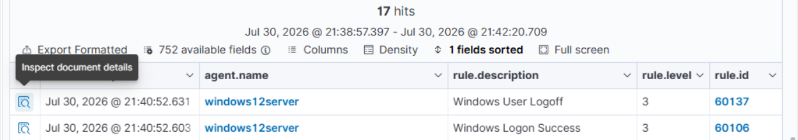
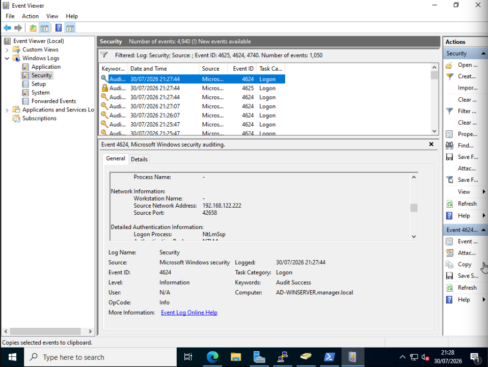

# Enterprise Active Directory Incident Response Lab – SMB Credential Brute-Force Detection with Wazuh SIEM

**Project Type:** SOC / Incident Response Lab  
**Platform:** Windows Server 2022 Active Directory, Wazuh SIEM, Sysmon, Kali Linux  
**Status:** Completed  
**Analyst:** Security Operations Center (SOC) Lead  
**Date:** July 30, 2026  

---

## Project Overview

This project demonstrates the end-to-end incident response process for a simulated SMB credential brute-force attack against a Windows Server 2022 Active Directory Domain Controller (`DC01`). The investigation leverages Windows Security Event Logs, Sysmon telemetry, and Wazuh SIEM to detect, investigate, contain, and remediate the attack in real time.

---

## Skills Demonstrated

- **Security Operations & Monitoring:** Event correlation, rule triggering, and log ingestion in Wazuh SIEM.
- **Incident Response & Triage:** Threat containment, session termination, host firewall isolation, and credential management.
- **Threat Hunting & Forensic Analysis:** Analyzing Windows Security Event Logs (`4625`, `4624`, `4634`) and Sysmon operational logs (`Event ID 3`).
- **Active Directory Administration:** Automated account containment via AD PowerShell modules (`Disable-ADAccount`, `Set-ADAccountPassword`).
- **Threat Framework Mapping:** Mapping attacker techniques to the MITRE ATT&CK framework (`T1110.001`, `T1078.002`, `T1021.002`).
- **Indicators of Compromise (IOC) Analysis:** Aggregating and documenting network, host, and system IOCs.

---

## 1. Executive Summary

This project demonstrates a simulated Security Operations Center (SOC) investigation into an SMB credential brute-force attack targeting a Windows Server 2022 Active Directory Domain Controller (`DC01`).

During the exercise, an attacker operating from internal IP `192.168.122.122` executed an automated SMB dictionary attack against domain account `JohnDoe`. Windows Security Logs, Sysmon telemetry, and Wazuh SIEM successfully detected the attack, correlated failed authentication attempts, identified a successful network logon using valid credentials obtained via password guessing, and generated high-severity alerts for analyst investigation.

Following detection, immediate containment actions were performed: the compromised account was isolated via PowerShell, active SMB network sessions were terminated, and host-based firewall rules were deployed to block the attacker's IP address.

No secondary lateral movement, privilege escalation, persistence, or post-exploitation activity was observed following containment.

---

## 2. Infrastructure & Environment Topology

| Component | Hostname / OS | IP Address | Agent / Component |
| :--- | :--- | :--- | :--- |
| **Attacker Host** | Kali Linux | `192.168.122.122` | CrackMapExec / Hydra |
| **Domain Controller** | DC01 (Windows Server 2022) | `192.168.122.114` | Wazuh Agent v4.x + Sysmon v15.x |
| **SIEM / Manager** | Ubuntu Server | `192.168.122.103` | Wazuh Manager + Indexer + Dashboard |

```
                     ┌────────────────────────────────┐
                     │     Kali Attacker Host         │
                     │      192.168.122.122           │
                     └───────────────┬────────────────┘
                                     │
                                     │ 1. SMB Dictionary Attack (Port 445)
                                     ▼
┌────────────────────────────────────────────────────────────────────────┐
│  Target: DC01 (192.168.122.114)                                        │
│  - Windows Event ID 4625 (Logon Failures)                              │
│  - Windows Event ID 4624 (Logon Success)                               │
│  - Sysmon Event ID 3 (Network Connection)                              │
└────────────────────────────────────┬───────────────────────────────────┘
                                     │
                                     │ 2. Log Ingestion (Port 1514/1515)
                                     ▼
                     ┌────────────────────────────────┐
                     │    Wazuh Manager / SIEM        │
                     │      192.168.122.103           │
                     └────────────────────────────────┘
```

---

## 3. Lab Screenshots

### Wazuh Detection


### Windows Event Viewer — Authentication Audit Telemetry (Successful Logon)


---

## 4. Incident Timeline (UTC)

| Timestamp | Event / Detection Source | Details & Impact |
| :--- | :--- | :--- |
| **19:25:10** | Inbound Connection (Sysmon ID 3) | Inbound TCP connection on Port 445 detected from `192.168.122.122`. |
| **19:27:15** | Brute-Force Probing (Win ID 4625) | Rapid failed logon attempts recorded for `MANAGER\JohnDoe` (SubStatus `0xc000006a`). |
| **19:27:20** | Rule Threshold Triggered (Wazuh) | Wazuh Manager correlates failures; triggers Rule 60115 (Multiple Windows logon failures). |
| **19:27:44** | Successful Authentication (Win ID 4624) | Valid credential match logged for `MANAGER\JohnDoe`. Wazuh Rule 60106 fired. |
| **19:29:10** | Session Logoff (Win ID 4634) | Session closed following authentication probe (Rule 60137). |
| **19:32:00** | Analyst Triage Initiated | SOC Analyst reviewed threat dashboard and initiated containment protocol. |
| **19:35:00** | Incident Containment Executed | Account `JohnDoe` disabled, active SMB sessions purged, and attacker IP blocked via Defender Firewall. |

---

## 5. Detection Sources & Telemetry Analysis

### A. Detection Sources Summary

* **Windows Security Event Logs:**
  * **Event ID 4625:** An account failed to log on (Logon Type 3).
  * **Event ID 4624:** An account was successfully logged on (Logon Type 3).
  * **Event ID 4634:** An account was logged off.
* **Sysmon Operational Logs:**
  * **Event ID 3:** Network connection detected (TCP 445 / SMB).
* **Wazuh SIEM Correlation Rules:**
  * **Rule 60109:** Windows: Logon failure
  * **Rule 60115:** Multiple Windows logon failures from same source (Level 10)
  * **Rule 60106:** Windows: Successful logon
  * **Rule 60137:** Windows User Logoff

### B. Detailed Telemetry Evidence

#### 1. Windows Security Event ID 4625 (Failed Logon)
* **Logon Type:** 3 (Network - SMB/NBT)
* **Source Network Address:** `192.168.122.122`
* **Target Account:** `JohnDoe`
* **Failure Reason:** `0xc000006a` (Username exists, but password was incorrect)
* **Authentication Package:** NTLM

#### 2. Windows Security Event ID 4624 (Successful Logon)
* **Logon Type:** 3 (Network)
* **Source Network Address:** `192.168.122.122`
* **Target Account:** `JohnDoe`
* **Target Domain:** `MANAGER`
* **Authentication Package:** NTLM V2

#### 3. Sysmon Event ID 3 (Network Connection)
* **Source IP:** `192.168.122.122`
* **Destination IP:** `192.168.122.114`
* **Destination Port:** 445 (SMB)
* **Image:** `System` / `lsass.exe`

---

## 6. Indicators of Compromise (IOCs)

| Indicator Type | Value | Description / Context |
| :--- | :--- | :--- |
| **Attacker IPv4** | `192.168.122.122` | Internal Kali Linux machine running brute-force tool |
| **Target IPv4** | `192.168.122.114` | Domain Controller (`DC01.manager.local`) |
| **Target Protocol** | SMB (TCP/445) | Server Message Block File Sharing & NTLM Auth |
| **Compromised Account** | `MANAGER\JohnDoe` | Active Directory user account targeted by password guessing |
| **Windows Events** | `4625`, `4624`, `4634` | Security Event Audit Logs |
| **Sysmon Event** | `3` | Operational Network Connection Telemetry |
| **Wazuh Rules** | `60109`, `60115`, `60106`, `60137` | SIEM Alerts & Correlation Triggers |

---

## 7. MITRE ATT&CK Mapping

| Tactic | Technique Name | ID | Context |
| :--- | :--- | :--- | :--- |
| **Credential Access** | Brute Force: Password Guessing | `T1110.001` | Automated dictionary attack against user `JohnDoe` over SMB. |
| **Persistence / Exec** | Valid Accounts: Domain Accounts | `T1078.002` | Valid credentials discovered and used to authenticate successfully. |
| **Lateral Movement** | Remote Services: SMB/Windows Admin Shares | `T1021.002` | SMB protocol targeted on Port 445 to test credential pairs. |

---

## 8. Root Cause Analysis

1. **Weak Password Policy:** The target account utilized a simple password vulnerable to standard wordlist dictionary attacks.
2. **Missing Automated Active Response:** The endpoint was not configured with an automated response mechanism (such as Wazuh Active Response) to block source IPs dynamically after consecutive authentication failures.
3. **Unrestricted Subnet SMB Access:** TCP Port 445 on the Domain Controller was accessible to the host's subnet without microsegmentation or host firewall limits restricting SMB traffic to administrative jump boxes.

---

## 9. Containment & Remediation Actions

### Step 1: Account Isolation & Password Reset
The compromised domain account was immediately disabled to prevent persistence or unauthorized access, followed by an administrative password reset:

```powershell
# Disable the compromised user account
Disable-ADAccount -Identity "JohnDoe"

# Reset user password to a complex string
Set-ADAccountPassword -Identity "JohnDoe" -Reset -NewPassword (ConvertTo-SecureString "C0mplex#P@ss2026!" -AsPlainText -Force)
```

### Step 2: Network Containment
Created an inbound Windows Defender Firewall rule to drop all incoming traffic from the attacker's IP address:

```powershell
New-NetFirewallRule -DisplayName "Block Attacker IP - IR-2026-001" `
                    -Direction Inbound `
                    -Action Block `
                    -RemoteAddress "192.168.122.122" `
                    -Enabled True
```

### Step 3: Session Termination
Purged all active SMB sessions originating from the malicious host:

```powershell
Get-SmbSession | Where-Object { $_.ClientComputerName -eq "192.168.122.122" } | Close-SmbSession -Force
```

---

## 10. Lessons Learned & Recommendations

1. **Enforce Fine-Grained Password Policies (FGPP):** Configure policies requiring minimum 14+ character passwords and enforce account lockout thresholds (e.g., lock accounts for 15 minutes after 5 failed attempts).
2. **Deploy Wazuh Active Response:** Integrate Wazuh Active Response scripts to automatically execute firewall IP blocks when Rule `60115` is triggered.
3. **Apply Network Segmentation & SMB Hardening:** Restrict inbound SMB (Port 445) access on Domain Controllers using Host Firewalls so only trusted jump servers and administrative endpoints can connect.
4. **Disable NTLMv1 / Enforce Kerberos:** Disable legacy NTLM authentication packages where possible across the Active Directory domain to reduce exposure to offline and online password cracking attacks.

---

### Raw Evidence Artifact: Windows Event ID 4624 (XML Extract)

```xml
<Event xmlns="http://schemas.microsoft.com/win/2004/08/events/event">
  <System>
    <Provider Name="Microsoft-Windows-Security-Auditing" Guid="{54849625-5478-4994-a5ba-3e3b0328c30d}" />
    <EventID>4624</EventID>
    <Version>2</Version>
    <Level>0</Level>
    <Task>12544</Task>
    <Opcode>0</Opcode>
    <Keywords>0x8020000000000000</Keywords>
    <TimeCreated SystemTime="2026-07-30T19:27:44.9873920Z" />
    <EventRecordID>4938</EventRecordID>
    <Channel>Security</Channel>
    <Computer>AD-WINSERVER.manager.local</Computer>
  </System>
  <EventData>
    <Data Name="TargetUserSid">S-1-5-21-432337814-2516319436-2478357680-1106</Data>
    <Data Name="TargetUserName">JohnDoe</Data>
    <Data Name="TargetDomainName">MANAGER</Data>
    <Data Name="LogonType">3</Data>
    <Data Name="LogonProcessName">NtLmSsp</Data>
    <Data Name="AuthenticationPackageName">NTLM</Data>
    <Data Name="LmPackageName">NTLM V2</Data>
    <Data Name="IpAddress">192.168.122.122</Data>
    <Data Name="IpPort">42658</Data>
  </EventData>
</Event>
```

---

## Technologies

- Windows Server 2022
- Active Directory
- Wazuh SIEM
- Sysmon
- PowerShell
- Kali Linux
- CrackMapExec
- Hydra

---

## License

This project is licensed under the MIT License - see the [LICENSE](LICENSE) file for details.
